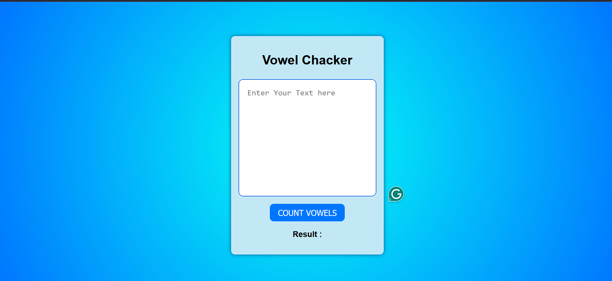
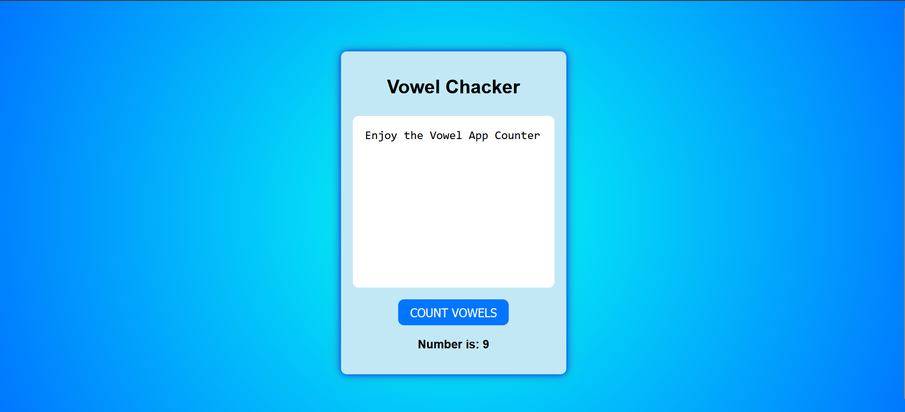

## Vowel Countre App

This project is a simple App that allows you to check the number of vowels in your paragraph. This is a simple example .

## Installation :

Instructions on how to install and set up the project.

```bash
# Clone the repository
git clone https://github.com/chebichebkheireddine/Vowel-Conter-App.git

```

## How To Use :


1. Open the `index.html` file in your web browser.

2. The app will be displayed on the screen with buttons to check the number of vowels. Simply write your paragraph in the textarea and click the corresponding button.

Enjoy using the Vowel Counter app!


